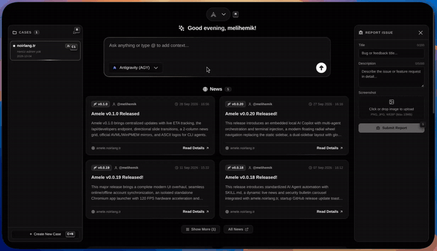

<div align="center">


# Amele Forensic Tool

*Windows, Linux, Android, and iOS unified digital forensics platform. Disk, RAM, logical acquisition, and backup analysis.*

[Website](https://amele.noirlang.tr) | [Releases](https://github.com/noirlang/amele/releases) | [License (EULA)](LICENSE) | [Agents](agent/README.md)



</div>

## Overview

Amele is a desktop forensic acquisition platform for authorized digital investigations. It brings disk imaging, memory acquisition, Android collection, iOS backup normalization, hash verification, case output handling, image viewing, and reporting into one unified native application.

The app runs as a real desktop window on Linux and Windows.

## Features

- **Local disk acquisition:** create raw disk images from local disks or image files with RAW or AFF4 output formatting.
- **Remote disk acquisition (Agent):** collect disk images through the Amele Linux and Windows agents with live throughput and hashing.
- **Agentless remote acquisition (SSH / WinRM):** acquire full remote physical disks and RAM over OpenSSH / WinRM directly without installing any agent on Linux or Windows targets.
- **Local memory acquisition:** capture RAM with AVML on Linux and WinPMEM on Windows.
- **Remote memory acquisition:** capture remote memory dumps via Agent or Agentless SSH streaming (`/proc/kcore`, AVML, WinPMEM).
- **Output format flexibility:** choose between bit-by-bit RAW (`.raw` / `.img`) or forensically packaged AFF4 (`.aff4`) formats.
- **Android tools:** check ADB, list devices, collect logical data, collect filesystem data, capture volatile data, and analyze Android case outputs.
- **iOS tools:** normalize unencrypted or already decrypted iTunes/Finder backups into a browsable Backup2FS-style file system, with per-file MD5/SHA1/SHA256 CSV logging.
- **Docker & Container DFIR:** audit container escape risks, scan environment variables for exposed secrets/API keys, extract raw configs and logs, package runtime Overlay2 UpperDir drift layers, and stream remote container evidence via Linux Agent.
- **Case management:** store acquisitions, notes, hashes, Android outputs, iOS outputs, reports, and `case_manifest.json` integrity inventories under selected cases.
- **Hashing and verification:** calculate MD5, SHA1, SHA256, and SHA512; generate sidecar hashes and verify file integrity on the fly.
- **Image viewing:** mount supported images read-only for inspection.
- **Reports:** create case reports from collected outputs, notes, and iOS backup metadata summaries.
- **Updates:** check GitHub releases and download platform installers from inside the app.

## Downloads

Official binary distributions and installers are published on GitHub Releases and on the website:

- **Linux AppImage:** `amele-linux-x64.AppImage`
- **Linux DEB:** `amele-linux-x64.deb`
- **Linux RPM:** `amele-linux-x64.rpm`
- **Arch Linux package:** `amele-linux-x64.pkg.tar.zst`
- **Windows MSI Installer:** `amele-windows-x64.msi`

Official Agent Binaries:

```text
https://amele.noirlang.tr/amele-linux
https://amele.noirlang.tr/amele-win.exe
```

## Remote Agents

Run the pre-compiled Linux agent on the target machine:

```bash
wget -O amele-linux https://amele.noirlang.tr/amele-linux
chmod +x amele-linux
./amele-linux --port 9000 --key <your-token>
```

Download and run the Windows agent:

```text
https://amele.noirlang.tr/amele-win.exe
```

```powershell
.\amele-win.exe --port 9000 --key <your-token>
```

Connect to the remote agent from the Amele desktop application using the target IP address, port, and security token.

## License

Copyright (c) 2026 noirLang. All rights reserved.

Amele Forensic Tool is distributed under the noirLang End User License Agreement (EULA). Official binary releases may be freely downloaded, installed, and executed for authorized forensic investigations, DFIR operations, and research. Reverse engineering, decompilation, disassembly, tampering, or cracking is strictly prohibited.

For complete license terms, see [LICENSE](LICENSE) or visit [https://amele.noirlang.tr/license](https://amele.noirlang.tr/license).

---

<div align="center">


# Amele Adli Bilişim Aracı (Forensic Tool)

*Windows, Linux, Android ve iOS için bütünleşik adli bilişim platformu. Disk, RAM, mantıksal edinim ve yedekleme analizi.*

[Web Sitesi](https://amele.noirlang.tr) | [Sürümler](https://github.com/noirlang/amele/releases) | [Lisans Sözleşmesi (EULA)](LICENSE) | [Ajanlar](agent/README.md)


</div>

## Genel Bakış

Amele, yetkili incelemeler için geliştirilmiş bütünleşik bir masaüstü adli edinim ve analiz platformudur. Disk imajı alma, bellek (RAM) edinimi, Android veri toplama, iOS backup normalizasyonu, hash doğrulama, vaka çıktısı yönetimi, imaj görüntüleme ve raporlama özelliklerini tek bir yerel uygulamada bir araya getirir.

Uygulama Linux ve Windows üzerinde yerel masaüstü penceresi olarak çalışır.

## Özellikler

- **Yerel disk edinimi:** Yerel disklerden veya imaj dosyalarından RAW veya AFF4 formatında disk imajları oluşturun.
- **Uzak disk edinimi (Ajan):** Linux ve Windows ajanları (agents) aracılığıyla canlı akış ve hash doğrulama ile uzak disk imajları toplayın.
- **Agentsız uzak edinim (SSH / WinRM):** Hedef sisteme ajan kurmadan OpenSSH veya WinRM bağlantısıyla uzaktan fiziksel disk ve RAM edinimini doğrudan gerçekleştirin.
- **Yerel bellek (RAM) edinimi:** Linux üzerinde AVML ve Windows üzerinde WinPMEM ile RAM bellek kopyasını alın.
- **Uzak bellek (RAM) edinimi:** Ajanlar veya agentsız SSH akışı (`/proc/kcore`, AVML, WinPMEM) üzerinden canlı RAM dökümü alın.
- **Format esnekliği:** Ham bit-by-bit RAW (`.raw` / `.img`) veya adli paketli AFF4 (`.aff4`) edinim formatlarını seçin.
- **Android araçları:** ADB durumunu kontrol edin, cihazları listeleyin, mantıksal veri toplayın, dosya sistemi verisi toplayın, uçucu (volatile) verileri alın ve Android vaka çıktılarını analiz edin.
- **iOS araçları:** Şifresiz veya önceden decrypt edilmiş iTunes/Finder backup klasörlerini Backup2FS düzeninde gezilebilir dosya sistemine dönüştürün; her dosya için MD5/SHA1/SHA256 CSV log üretin.
- **Docker ve Konteyner Adli Bilişimi:** Konteyner kaçış risklerini denetleyin, ortam değişkenlerindeki parola/token sızıntılarını tespit edin, runtime Overlay2 UpperDir drift katmanını arşivleyin ve canlı/uzak konteyner delillerini toplayın.
- **Vaka yönetimi:** Edinimleri, notları, hash değerlerini, Android/iOS çıktılarını, raporları ve `case_manifest.json` bütünlük envanterlerini seçilen vakalar altında saklayın.
- **Hash hesaplama ve doğrulama:** MD5, SHA1, SHA256 ve SHA512 hesaplayın; elde edilen deliller için yan dosya (sidecar) hash dosyaları oluşturun.
- **İmaj görüntüleme:** Desteklenen imajları inceleme amacıyla salt okunur (read-only) olarak bağlayın (mount).
- **Raporlar:** Toplanan çıktılardan, notlardan ve iOS backup metadata özetlerinden vaka raporları oluşturun.
- **Güncellemeler:** Uygulama içerisinden GitHub sürümlerini kontrol edin ve platform yükleyicilerini indirin.

## İndirmeler

Kararlı resmi kurulum paketleri GitHub Sürümleri (Releases) sayfasında ve web sitesinde yayınlanmaktadır:

- **Linux AppImage:** `amele-linux-x64.AppImage`
- **Linux DEB:** `amele-linux-x64.deb`
- **Linux RPM:** `amele-linux-x64.rpm`
- **Arch Linux Paketi:** `amele-linux-x64.pkg.tar.zst`
- **Windows MSI Kurulum Paketi:** `amele-windows-x64.msi`

Ajan (Agent) ikili dosyaları:

```text
https://amele.noirlang.tr/amele-linux
https://amele.noirlang.tr/amele-win.exe
```

## Uzak Ajanlar

Hedef makinede Linux ajanını çalıştırın:

```bash
wget -O amele-linux https://amele.noirlang.tr/amele-linux
chmod +x amele-linux
./amele-linux --port 9000 --key <token>
```

Windows ajanını indirin ve çalıştırın:

```text
https://amele.noirlang.tr/amele-win.exe
```

```powershell
.\amele-win.exe --port 9000 --key <token>
```

IP adresi, port ve belirlediğiniz token ile uygulama içerisinden ajana bağlanın.

## Lisans

Copyright (c) 2026 noirLang. Tüm hakları saklıdır.

Amele Adli Bilişim Aracı, noirLang Son Kullanıcı Lisans Sözleşmesi (EULA) kapsamında sunulmaktadır. Resmi ikili dosyalar adli bilişim incelemeleri, DFIR operasyonları ve araştırmalar için ücretsiz olarak indirilebilir ve çalıştırılabilir. Yazılım üzerinde herhangi bir tersine mühendislik (reverse engineering), decompile, disassemble, yamalama veya kırma işlemi kesinlikle yasaktır.

Tam lisans metni için [LICENSE](LICENSE) dosyasına veya [https://amele.noirlang.tr/license](https://amele.noirlang.tr/license) adresine göz atabilirsiniz.
