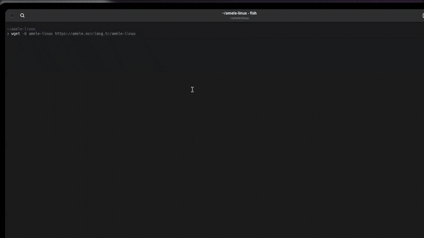
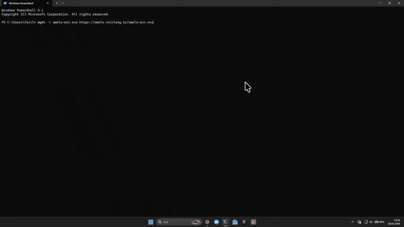

<div align="center">


# Amele Forensic Agents

*Remote forensic acquisition agents for Linux and Windows targets.*

[Back to Main Repo](../README.md) | [Website](https://amele.noirlang.tr) | [Releases](https://github.com/noirlang/amele/releases)

<table width="100%">
  <tr>
    <td width="50%" align="center">
      <b>Linux Agent</b><br/><br/>
      
    </td>
    <td width="50%" align="center">
      <b>Windows Agent</b><br/><br/>
      
    </td>
  </tr>
</table>

</div>

## Overview

Amele Forensic Agents are lightweight standalone services that enable remote disk imaging, memory acquisition, and container forensics on Linux and Windows targets. They communicate securely with the main Amele desktop application over TCP with token-based authentication.

## Features

- **Remote disk acquisition:** collect disk images from remote targets with live throughput and hashing
- **Remote memory acquisition:** capture RAM dumps via AVML (Linux) or WinPMEM (Windows)
- **Container forensics:** audit Docker containers, extract logs, configs, and drift layers
- **Token-based authentication:** secure communication with the main Amele application
- **Cross-platform:** Linux and Windows standalone binary support
- **Zero runtime dependencies:** pre-compiled self-contained binaries

## Downloads

Official standalone agent binaries:

- **Linux Agent (x86_64):**
  ```bash
  wget -O amele-linux https://amele.noirlang.tr/amele-linux
  chmod +x amele-linux
  ```

- **Windows Agent (x86_64):**
  Download: [https://amele.noirlang.tr/amele-win.exe](https://amele.noirlang.tr/amele-win.exe)

## Usage

### Linux Agent

Run with default port (9000) and your authentication token:

```bash
./amele-linux --port 9000 --key <your-token>
```

### Windows Agent

Run via Command Prompt or PowerShell:

```powershell
.\amele-win.exe --port 9000 --key <your-token>
```

### Connecting from Amele Desktop

1. Open Amele desktop application.
2. Navigate to **Uzak Edinim (Remote Acquisition)** / Agent.
3. Enter the target machine's IP address, port, and security token.
4. Start live disk imaging or RAM acquisition.

## License

Copyright (c) 2026 noirLang. All rights reserved.

Distributed under the noirLang Proprietary EULA. See [LICENSE](../LICENSE) or visit [https://amele.noirlang.tr/license](https://amele.noirlang.tr/license) for full terms.
